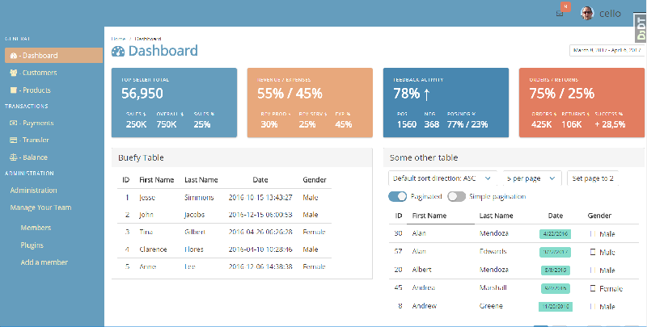

# django-vue-buefy-dashboard

This is a boilerplate project for setting up a Dashboard based on the following frameworks:
- Django as a backend with all the basic admin stuff included
- Vue.js as the frontend
- Buefy as the Vue.js components to use
- Bulma as the css framework where Buefy is based on



## Work in Progress
**Beware!** This is a work in progress and may not be reliable working right now. The following elements will be added in the (hopefully) near future:
- [X] Custom Login Page
- [ ] Custom User Profile Page with extended user attributes
- [ ] Custom Sign-Up Page
- [ ] Password Reset and E-Mail verification functionality
- [ ] Charts with either Charts.js or ECharts

## Credits 
As a fairly new user/programmer of Django and Vue, this template is based on a lot of contributions I found on the internet. Without them I would not have been able to put together this boilerplate. 
- https://github.com/rokups/hello-vue-django
- https://github.com/mazipan/bulma-admin-dashboard-template
- https://github.com/buefy/buefy
- https://scotch.io/bar-talk/build-an-app-with-vuejs-and-django-part-one
- https://github.com/rafaelpimpa/buefy-simple

and of course the frameworks in use
- https://bulma.io/
- https://www.djangoproject.com/
- https://vuejs.org/


### Prerequisites
- install nmp
- install python > 3.6 (i did trough Conda)
- make a virtual environment (`conda activate xyz`)

### Features
*shamelessly copied from [rokups](https://github.com/rokups)*

* Django backend in `./backend`
* vuejs (v2) frontend in `./frontend`
* Hot-reload with vue-loader
* eslint linter integration
* Makefile to make your life easy


### Development environment setup

When you generated a virtual environment for python (I called mine "django-vue"), then you can activate it with the following make command (edit `Makefile` for your environment)

```bash
make startup
```

These steps will install all required dependencies including development ones, run migrations and start dev server.

```bash
make dev
make migrate
make run
```

Dont forget after the first run to create a superuser
```bash
python manage createsuperuser
```

### Deployment

These steps will install production dependencies and build vuejs application to `static/dist` folder.

```bash
make prod
make build
```

If you want to run the deployment build ob your local machine you can start it with

```bash
make runprod
```


### Be aware

For the sake of simplicity Django config is contained within its own backend app. In real world setting you would probably want to remove `backend` from `INSTALLED_APPS`, create a new app and move `backend.views` to it.

You probably want to create python virtual environment as well. Default python instance available will be used.
